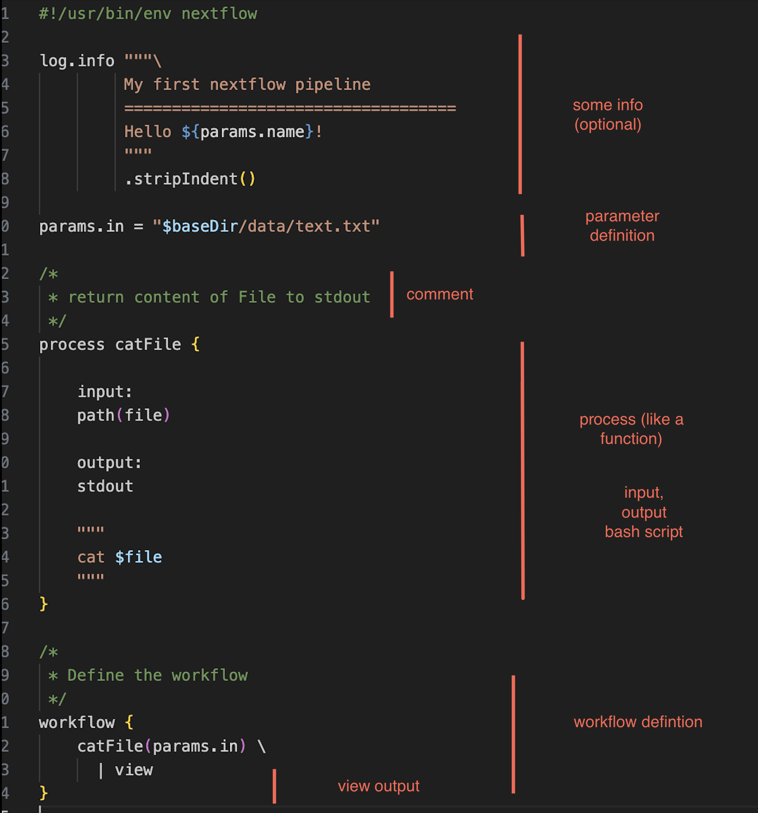

# Introduction

# Why to use nextflow?

1. Reproducible Pipelines: create pipelines that can be easily found, accessed, used with other systems, and reused. This follows the FAIR guidelines.
2. Version Control and Containers: Nextflow supports these features to manage software dependencies effectively.
3. Portability: Pipelines created on a laptop can be easily scaled up to run on high-performance clusters or various cloud platforms like AWS, Azure, Google Cloud, or Kubernetes. Nextflow ensures your code works well in different environments.
4. Scalability: Nextflow can handle large-scale tasks by running many processes in parallel, without being tied to a specific platform or service.
5. Flexibility: It's designed to meet various scientific workflow needs, like saving time on repeated calculations and providing detailed reports on your workflows.
6. Growing and Supportive Community: Since its start in 2013, Nextflow has been growing quickly. It has a strong community of developers and support from Seqera Labs.
7. Open Source: Nextflow is free to use, modify, and distribute under the Apache 2.0 license.

# What we will learn

- Simple Worklflow
- Channels
- Workflow for RNA-seq


- Debugging
- channel factory 
- tuple 


### Basic structure 


# Simple example




How to run:

'''
nextflow run main-1.nf --name [your name here]
'''

# Channels

'Variables'


## Value Channels 
### Channel of
``````
// Channel.of create channel 
bases = Channel.of('A', 'C', 'G', 'T')
bases.view()
``````
Output:
```{r class.source="bg-danger", class.output="bg-warning"}
A
C
G
T
```
## Channel factories¶

These are Nextflow commands for creating channels that have implicit expected inputs and functions.
### Combine
``````
numbers = Channel.of(1, 2, 3, 4)
numbers_bases = numbers.combine(bases)
numbers_bases.view()
``````
Output:
```{r df-drop-ok, class.source="bg-success"}
[1, A]
[1, C]
[2, A]
[2, C]
[1, G]
[2, G]
[1, T]
[2, T]
```

### from File Pairs
`````

Channel
    .fromFilePairs('./data/*_{1,2}.fa')
    .view()
`````

````
[potato, [/data/potato_1.fa, /data/potato_2.fa]]
[frog, [data/frog_1.fa, /data/frog_2.fa]]
````

### Download from SRA

```
ids = ['ERR908507', 'ERR908506', 'ERR908505']
Channel
    .fromSRA(ids, apiKey: params.ncbi_api_key)
    .view()
```

``````
[ERR908507, [/vol1/fastq/ERR908/ERR908507/ERR908507_1.fastq.gz, /vol1/fastq/ERR908/ERR908507/ERR908507_2.fastq.gz]]
[ERR908506, [/vol1/fastq/ERR908/ERR908506/ERR908506_1.fastq.gz, /vol1/fastq/ERR908/ERR908506/ERR908506_2.fastq.gz]]
[ERR908505, [/vol1/fastq/ERR908/ERR908505/ERR908505_1.fastq.gz, /vol1/fastq/ERR908/ERR908505/ERR908505_2.fastq.gz]]
``````


# Nextflow or snakemake?

Key Differences
### Scripting Language: 
Nextflow uses a Groovy-based DSL, while Snakemake uses Python.
### Execution Philosophy: 
Nextflow is data-driven, focusing on the flow of data, whereas Snakemake is rule-driven, focusing on file transformation rules.
### Community and Ecosystem: 
Nextflow might have a broader appeal across various computing environments, while Snakemake is particularly favored in Python-centric communities.
