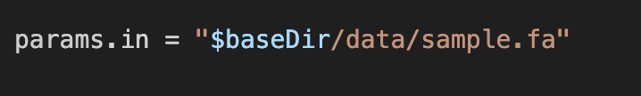

# Introduction

DSL: domain-specific scriptin language

Example process:
/*
 * Split a fasta file into multiple files
 */
process splitSequences {
 
    input:
    path 'input.fa'
 
    output:
    path 'seq_*'
 
    """
    awk '/^>/{f="seq_"++d} {print > f}' < input.fa
    """
}

# What we will learn

- simple process
- Debugging
- channel factory 
- tuple 

# Presentation
- Why tp use nextflow?

### Basic strucute 

# Input parameters

